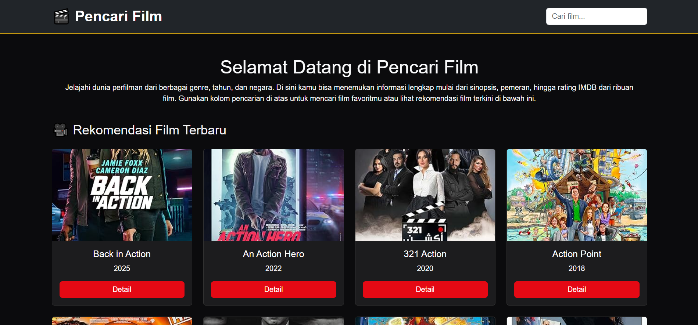
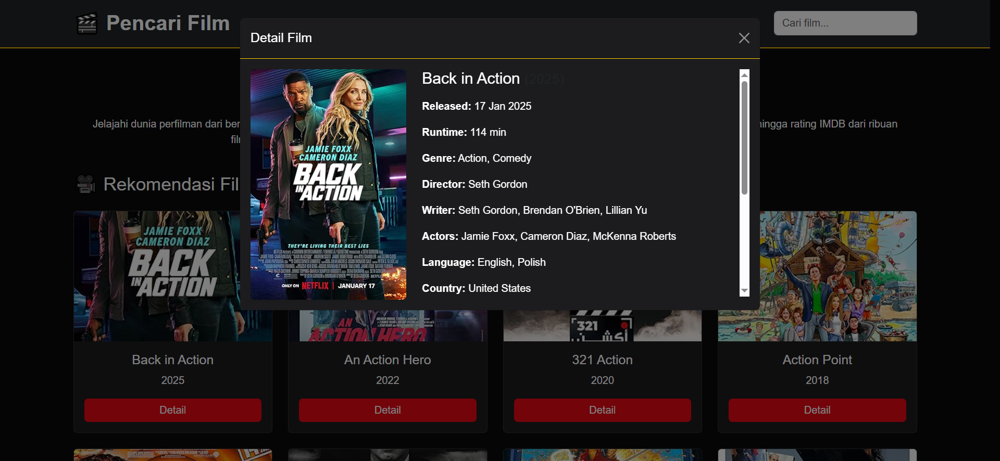
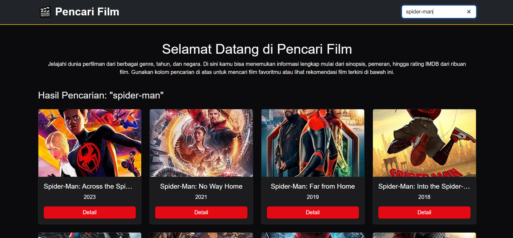

# 🎬 Aplikasi Website Pencarian Film


Aplikasi pencarian dan penayangan film terbaru berdasarkan tahun berjalan.  
Dibuat menggunakan **Bootstrap 5.3**, **jQuery 3.7**, dan **API OMDb** untuk mengambil data film secara real-time.

---

## 📸 Tampilan Aplikasi
<table>
  <tr>
    <td></td>
    <td></td>
    <td></td>
  </tr>
</table>

---

## ✨ Fitur Utama
- 🔍 **Pencarian Real-time** — Cari film berdasarkan judul dan tahun.
- 📅 **Rekomendasi Film** — Temukan film-film terbaru secara otomatis.
- 📄 **Detail Lengkap** — Lihat sinopsis, sutradara, pemain, dan rating IMDb.
- 📱 **Responsive Design** — Tampilan optimal di semua perangkat (mobile, tablet, desktop).

---

## 🛠 Teknologi yang Digunakan
- **HTML5**
- **CSS3** (Bootstrap 5.3)
- **JavaScript** (jQuery 3.7)
- **[OMDb API](https://www.omdbapi.com/)**
- **Bootstrap Icons**

---

## 🚀 Instalasi
1. Clone repositori:
   ```bash
   git clone https://github.com/reykamr/pencari-film.git
2. Buka file script.js, lalu Isi YOUR_API_KEY menggunakan API KEY pribadi dengan melakukan generate API KEY di website OMDB.
3. Buka file index.html di browser favorit masing-masing.
